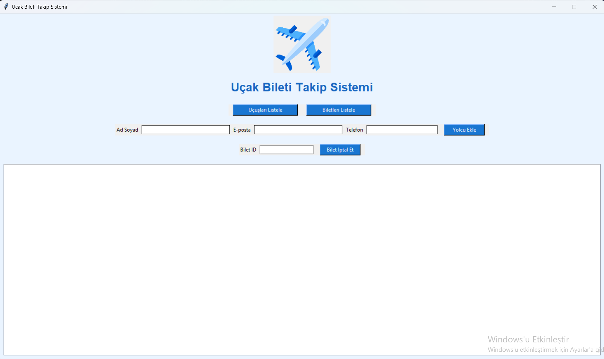
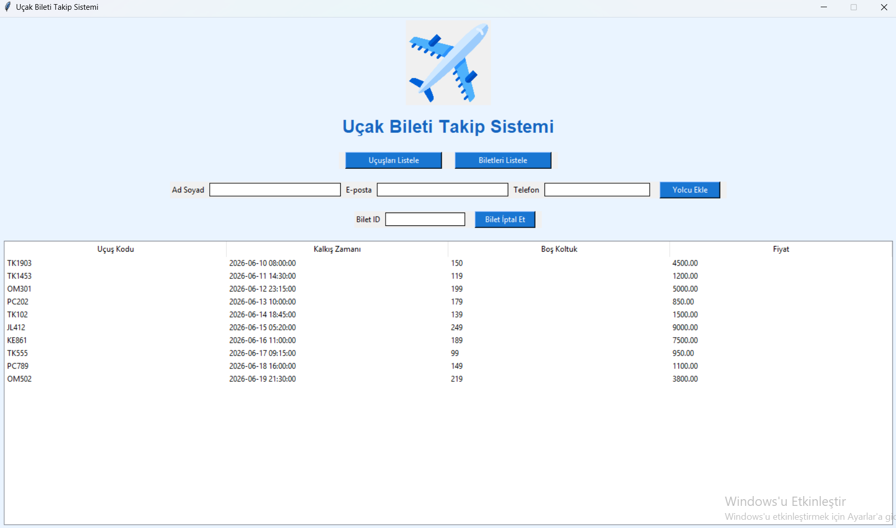
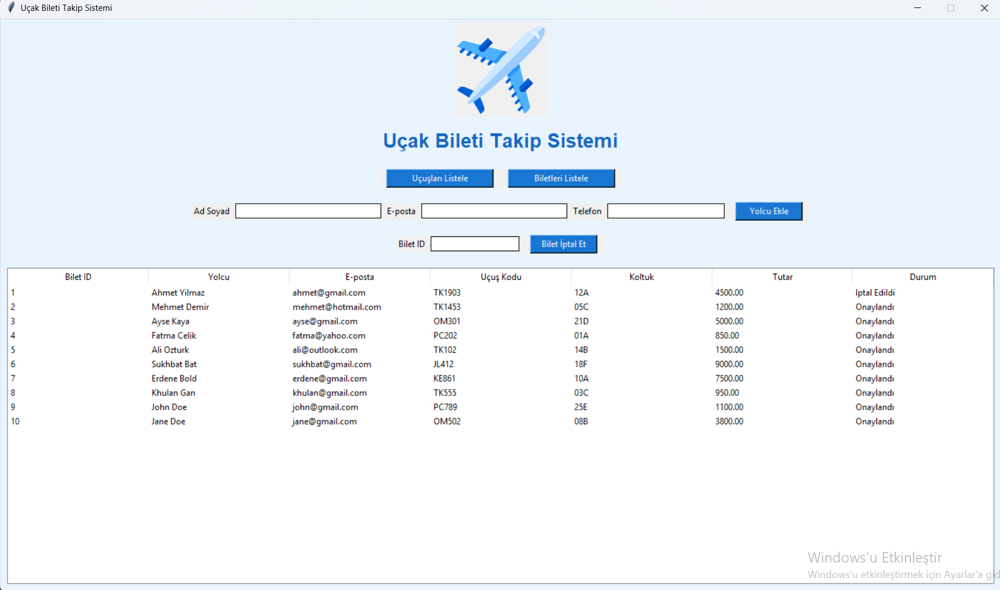

# Uçak Bileti Takip Sistemi

## 1. Problem Tanımı

Havayolu şirketleri ve kullanıcılar için uçuş, yolcu ve bilet bilgilerinin düzenli şekilde yönetilmesi gerekmektedir. Bu projede uçuşların listelenmesi, yolcuların sisteme eklenmesi, biletlerin görüntülenmesi ve iptal edilmesi işlemlerini gerçekleştiren bir masaüstü uygulama geliştirilmiştir.

---
## 2. Geliştiriciler
Grup 187
|öğrenci no | Ad Soyad | Görev |
|231307090| Eren Ceylan | Python, Tkinter Arayüzü, MySQL Bağlantısı, GitHub ve Dokümantasyon |
|231307134| Sukhryenchin Buyanorshikh| Veritabanı Tasarımı, SQL Betikleri |

## 3. Yapılan Araştırmalar

Proje geliştirilirken aşağıdaki konular araştırılmıştır:

* Python Tkinter ile grafiksel kullanıcı arayüzü geliştirme
* MySQL veritabanı tasarımı
* Python ile MySQL bağlantısı kurma
* CRUD işlemleri (Create, Read, Update, Delete)
* Treeview kullanarak tablo görüntüleme
* Git ve GitHub kullanımı

Karşılaşılan sorunlar:

* MySQL bağlantı hataları
* Tkinter görsel yerleşim problemleri
* SQL sorgularının Python ile entegrasyonu

Bu sorunlar Python ve MySQL dokümantasyonları incelenerek çözülmüştür.

---

## 4. Akış Şeması

Programın çalışma akışı:

Başlat
↓
MySQL Veritabanına Bağlan
↓
Ana Arayüzü Aç
↓
Kullanıcı İşlem Seçer

├─ Uçuşları Listele
├─ Biletleri Listele
├─ Yolcu Ekle
└─ Bilet İptal Et

↓
Veritabanını Güncelle
↓
Sonuçları Göster
↓
Program Sonu

---

## 5. Yazılım Mimarisi

Proje iki temel dosyadan oluşmaktadır:

### db.py

* MySQL bağlantısını sağlar.
* Veritabanı işlemlerini yürütür.

### main.py

* Tkinter arayüzünü oluşturur.
* Kullanıcı işlemlerini yönetir.
* Veritabanı sorgularını çalıştırır.

### assets/

* Uygulama görsellerini içerir.

---

## 6. Veritabanı Diyagramı (ER Diyagramı)

Tablolar:

### kullanicilar

* kullanici_id (PK)
* ad_soyad
* eposta
* telefon

### havalimanlari

* havalimani_id (PK)
* havalimani_adi
* sehir
* ulke

### ucuslar

* ucus_id (PK)
* ucus_kodu
* kalkis_yeri_id (FK)
* varis_yeri_id (FK)
* kalkis_zamani
* bos_koltuk_sayisi
* taban_fiyat

### biletler

* bilet_id (PK)
* kullanici_id (FK)
* ucus_id (FK)
* koltuk_no
* durum

### odemeler

* odeme_id (PK)
* bilet_id (FK)
* toplam_tutar
* odeme_yontemi

### ER Diyagramı görseli

---

## 7. Genel Yapı

Sistem kullanıcıların uçuşları görüntülemesini, yolcu eklemesini, bilet bilgilerini incelemesini ve bilet iptal işlemlerini gerçekleştirmesini sağlar.

Temel özellikler:

* Uçuş Listeleme
* Bilet Listeleme
* Yolcu Ekleme
* Bilet İptal Etme
* MySQL Veritabanı Kullanımı
* Grafiksel Arayüz

---

## 8. Arayüz Görselleri

### Ana Ekran

### Uçuş Listeleme

### Bilet Listeleme

---

## 9. Referanslar

* https://docs.python.org
* https://docs.python.org/3/library/tkinter.html
* https://dev.mysql.com/doc
* https://github.com

Proje geliştirme sürecinde OpenAI ChatGPT'den teknik destek alınmıştır.
